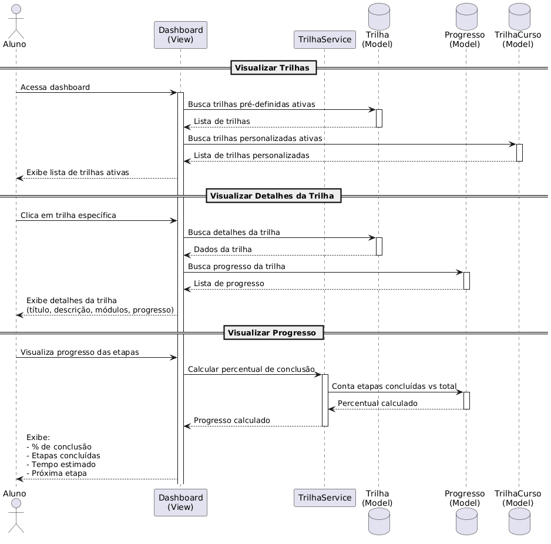

# Caso de Uso: Visualizar Trilha e Progresso

## Descrição
Este caso de uso permite que o aluno visualize suas trilhas de aprendizado e acompanhe o progresso em cada uma delas.

## Atores
- **Aluno**: Usuário que deseja visualizar e acompanhar suas trilhas de estudo

## Pré-condições
- Aluno deve estar autenticado no sistema
- Aluno deve possuir pelo menos uma trilha ativa (pré-definida ou personalizada)

## Fluxo Principal

### 1. Visualizar Trilhas
1. Aluno acessa o dashboard
2. Sistema busca todas as trilhas pré-definidas ativas do aluno
3. Sistema busca todas as trilhas personalizadas ativas do aluno
4. Sistema exibe lista consolidada de trilhas ativas

### 2. Visualizar Detalhes da Trilha
1. Aluno clica em uma trilha específica
2. Sistema busca os detalhes da trilha selecionada
3. Sistema busca o progresso associado à trilha
4. Sistema exibe:
   - Título da trilha
   - Descrição
   - Módulos/Etapas
   - Progresso atual

### 3. Visualizar Progresso
1. Aluno visualiza o progresso das etapas
2. Sistema solicita ao TrilhaService o cálculo do percentual de conclusão
3. TrilhaService conta etapas concluídas vs total de etapas
4. Sistema exibe:
   - Percentual de conclusão
   - Número de etapas concluídas
   - Tempo estimado para conclusão
   - Próxima etapa a ser realizada

## Pós-condições
- Aluno visualiza suas trilhas e progresso atualizado
- Sistema mantém registro do último acesso do aluno

## Fluxos Alternativos

### 3a. Nenhuma trilha ativa
1. Sistema exibe mensagem informando que não há trilhas ativas
2. Sistema sugere criar uma nova trilha ou ativar trilhas existentes

### 3b. Trilha sem progresso registrado
1. Sistema exibe trilha com 0% de conclusão
2. Sistema indica primeira etapa a ser iniciada

## Regras de Negócio
- **RN01**: Apenas trilhas ativas são exibidas no dashboard
- **RN02**: Progresso é calculado como: (etapas concluídas / total de etapas) × 100
- **RN03**: Aluno só pode visualizar trilhas associadas ao seu usuário
- **RN04**: Trilhas pré-definidas e personalizadas são exibidas juntas

## Requisitos Não-Funcionais
- **RNF01**: Tempo de resposta para carregar dashboard: < 2 segundos
- **RNF02**: Cálculo de progresso deve ser eficiente para trilhas com até 100 etapas
- **RNF03**: Interface deve ser responsiva (mobile e desktop)

## Componentes Envolvidos

### Views
- `dashboard` (config/usuarios/views.py)

### Services
- `TrilhaService` (config/api/services.py)

### Models
- `Trilha` (config/api/models.py)
- `TrilhaCurso` (config/api/models.py)
- `Progresso` (config/api/models.py)

### Templates
- `usuarios/templates/usuarios/dashboard.html`

## Diagrama de Sequência

### Visualização

**Figura**: Diagrama de sequência mostrando a interação entre Aluno, Dashboard, Services e Models para visualização de trilhas e progresso.