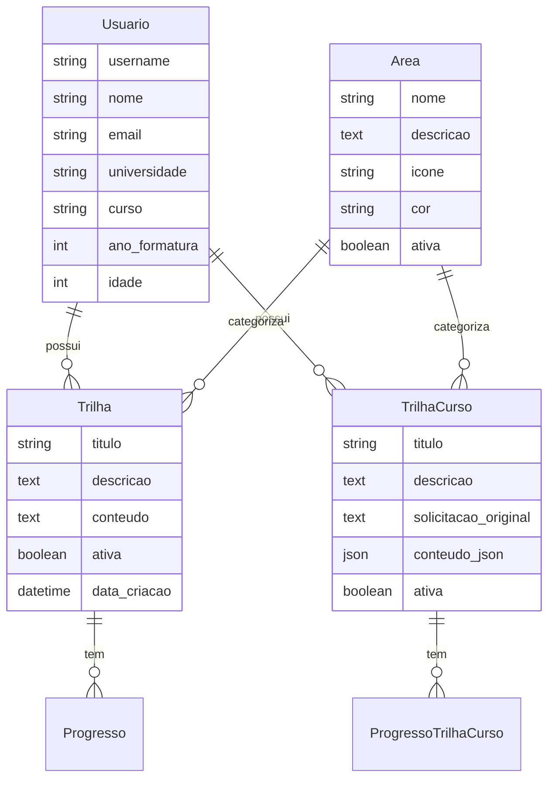

# 🏗️ Arquitetura do Sistema - EstudaAI

## 📋 Visão Geral

O EstudaAI é uma aplicação web Django que integra Inteligência Artificial para geração de trilhas de aprendizagem personalizadas.

## 🎯 Arquitetura de Alto Nível

```
┌─────────────────┐    ┌─────────────────┐    ┌─────────────────┐
│   Frontend      │    │    Backend      │    │   Serviços      │
│   (Templates)   │◄──►│    Django       │◄──►│   Externos      │
│                 │    │                 │    │                 │
│ • HTML/CSS/JS   │    │ • Models        │    │ • Google Gemini │
│ • Bootstrap     │    │ • Views         │    │ • APIs          │
│ • AJAX          │    │ • APIs          │    │                 │
└─────────────────┘    └─────────────────┘    └─────────────────┘
                              │
                              ▼
                       ┌─────────────────┐
                       │   Banco de      │
                       │     Dados       │
                       │                 │
                       │ • SQLite (dev)  │
                       │ • PostgreSQL    │
                       └─────────────────┘
```

## 📦 Estrutura de Módulos

### 1. **config/** - Configurações Django
```
config/
├── settings.py      # Configurações principais
├── urls.py         # URLs raiz
├── wsgi.py         # WSGI para produção
└── asgi.py         # ASGI para async
```

### 2. **usuarios/** - Sistema de Usuários
```
usuarios/
├── models.py       # Modelo Usuario (AbstractUser)
├── views.py        # Login, cadastro, perfil
├── forms.py        # Formulários de usuário
├── urls.py         # URLs de autenticação
└── templates/      # Templates de auth
```

### 3. **api/** - Core Business Logic
```
api/
├── models.py       # Area, Trilha, Progresso
├── views.py        # Views principais
├── views_gemini.py # Integração IA
├── gemini.py       # Cliente Gemini
├── services.py     # Lógica de negócio
├── serializers.py  # DRF serializers
└── urls.py         # APIs REST
```

## 🗄️ Modelo de Dados

### Entidades Principais



## 🔄 Fluxo de Dados

### 1. Geração de Trilha com IA
```
Usuario → Solicitação → Gemini API → Processamento → TrilhaCurso
   ↓
Estruturação JSON → Validação → Persistência → Exibição
```

### 2. Acompanhamento de Progresso
```
Usuario → Marcar Etapa → ProgressoTrilhaCurso → Cálculo % → Dashboard
```

## 🤖 Integração com IA

### Google Gemini
```python
# api/gemini.py
class GeminiService:
    def gerar_trilha(self, solicitacao: str) -> dict:
        # 1. Preparar prompt estruturado
        # 2. Chamar API Gemini
        # 3. Processar resposta JSON
        # 4. Validar estrutura
        # 5. Retornar trilha estruturada
```

### Estrutura de Resposta IA
```json
{
  "titulo": "Trilha de Python",
  "descricao": "Aprenda Python do básico ao avançado",
  "modulos": [
    {
      "titulo": "Fundamentos",
      "aulas": [
        {
          "titulo": "Sintaxe Básica",
          "descricao": "...",
          "recursos": ["link1", "link2"],
          "exercicios": ["ex1", "ex2"]
        }
      ]
    }
  ]
}
```

## 🔐 Segurança

### Autenticação
- **Django Auth** - Sistema nativo
- **Session-based** - Cookies seguros
- **CSRF Protection** - Tokens automáticos

### Autorização
- **User-based** - Cada usuário vê apenas suas trilhas
- **Admin Panel** - Acesso restrito a staff

### Dados Sensíveis
- **Environment Variables** - `.env` para configs
- **API Keys** - Nunca hardcoded
- **Secrets Management** - GitHub Secrets para CI

## 🚀 Deploy e Infraestrutura

### Desenvolvimento
```
Local Machine
├── SQLite Database
├── Django Dev Server
├── Static Files (local)
└── Environment Variables (.env)
```

### Produção (Sugerida)
```
Cloud Provider
├── PostgreSQL Database
├── Gunicorn + Nginx
├── Static Files (CDN)
├── Environment Variables (Secrets)
└── SSL/HTTPS
```

## 📊 Performance

### Otimizações Implementadas
- **Select Related** - Evita N+1 queries
- **Pagination** - Listas grandes
- **Caching** - Templates e queries
- **Static Files** - Compressão e minificação

### Monitoramento
- **Django Debug Toolbar** - Desenvolvimento
- **Logging** - Arquivo de logs
- **Error Tracking** - Para produção

## 🧪 Testabilidade

### Estrutura de Testes
```
tests/
├── unit/           # Testes unitários
├── integration/    # Testes de integração
├── fixtures/       # Dados de teste
└── mocks/          # Mocks para APIs externas
```

### Cobertura
- **Mínimo**: 70%
- **Foco**: Lógica de negócio
- **Exclusões**: Migrations, settings

## 🔄 CI/CD Pipeline

### GitHub Actions
```yaml
Trigger: Push/PR → main/develop
├── Test Job
│   ├── Setup Python
│   ├── Install Dependencies
│   ├── Run Tests
│   └── Coverage Report
├── Lint Job
│   ├── Black (formatting)
│   ├── isort (imports)
│   └── Flake8 (linting)
└── Security Job
    ├── Bandit (static analysis)
    └── Safety (dependencies)
```

## 📈 Escalabilidade

### Horizontal
- **Stateless Design** - Múltiplas instâncias
- **Database Separation** - Read/Write replicas
- **API Rate Limiting** - Controle de uso

### Vertical
- **Database Indexing** - Queries otimizadas
- **Caching Strategy** - Redis/Memcached
- **Background Tasks** - Celery para IA

## 🔧 Configuração

### Environment Variables
```env
# Django
SECRET_KEY=...
DEBUG=True/False
ALLOWED_HOSTS=...

# Database
DATABASE_URL=...

# External APIs
GEMINI_API_KEY=...
GEMINI_MODEL=...

# Security
CORS_ALLOW_ALL_ORIGINS=...
```

## 📚 Dependências Principais

### Backend
- **Django 5.2** - Framework web
- **DRF 3.14** - APIs REST
- **google-generativeai** - Cliente Gemini
- **python-dotenv** - Environment vars

### Development
- **pytest** - Framework de testes
- **black** - Formatação de código
- **flake8** - Linting
- **bandit** - Análise de segurança

## 🔮 Roadmap Técnico

### Próximas Melhorias
- [ ] **API GraphQL** - Queries flexíveis
- [ ] **WebSockets** - Updates em tempo real
- [ ] **Containerização** - Docker
- [ ] **Microservices** - Separação de domínios
- [ ] **Machine Learning** - Recomendações personalizadas

---

**📝 Documento vivo - Atualizado conforme evolução do sistema**