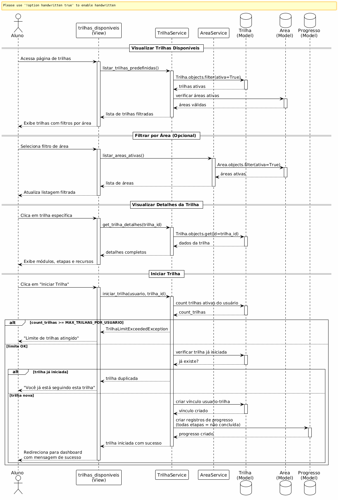

# Caso de Uso: Escolher Trilha Pré-definida

## Descrição
Este caso de uso permite que o aluno visualize trilhas de aprendizado pré-definidas disponíveis no sistema e escolha uma para adicionar ao seu plano de estudos.

## Atores
- **Aluno**: Usuário que deseja escolher uma trilha pré-definida para seus estudos
- **Sistema**: Plataforma EstudaAI

## Pré-condições
- Aluno deve estar autenticado no sistema
- Devem existir trilhas pré-definidas ativas cadastradas por administradores
- Devem existir áreas de conhecimento ativas no sistema

## Pós-condições
- Trilha pré-definida é vinculada ao aluno
- Aluno pode visualizar a trilha em seu dashboard
- Sistema registra a data de início da trilha
- Progresso inicial é criado (todas etapas marcadas como não concluídas)

---

## Fluxo Principal

1. Aluno acessa a página "Explorar Trilhas" ou "Trilhas Disponíveis"
2. Sistema busca todas as trilhas pré-definidas ativas
3. Sistema filtra trilhas com áreas ativas
4. Sistema exibe lista de trilhas com:
   - Título da trilha
   - Descrição resumida
   - Área de conhecimento (nome e ícone)
   - Nível de dificuldade (se aplicável)
   - Quantidade de módulos/etapas
5. Aluno pode filtrar trilhas por área de conhecimento
6. Aluno seleciona uma trilha específica para visualizar detalhes
7. Sistema exibe detalhes completos da trilha:
   - Título e descrição completa
   - Área de conhecimento
   - Estrutura de módulos e etapas
   - Recursos de aprendizagem incluídos
   - Objetivos de aprendizagem
8. Aluno clica em **"Iniciar Trilha"** ou **"Adicionar aos Meus Estudos"**
9. Sistema valida se aluno pode adicionar a trilha
10. Sistema cria vínculo entre aluno e trilha (registro em `Trilha`)
11. Sistema cria registros iniciais de `Progresso` para todas as etapas (marcadas como não concluídas)
12. Sistema exibe mensagem de sucesso: **"Trilha adicionada com sucesso!"**
13. Sistema redireciona aluno para o dashboard
14. Trilha aparece na lista de "Minhas Trilhas" ou "Trilhas Ativas"

---

## Fluxos Alternativos

### FA1 – Nenhuma trilha disponível
1. No passo 2 do fluxo principal, sistema não encontra trilhas pré-definidas ativas
2. Sistema exibe mensagem: **"Não há trilhas disponíveis no momento. Entre em contato com o administrador ou crie uma trilha personalizada."**
3. Sistema oferece opção de criar trilha personalizada com IA
4. Caso de uso é encerrado

### FA2 – Área da trilha inativa
1. No passo 3 do fluxo principal, sistema detecta que a área da trilha está inativa
2. Sistema não exibe essa trilha na listagem
3. Sistema filtra automaticamente apenas trilhas com áreas ativas
4. Fluxo retorna ao passo 4

### FA3 – Trilha já iniciada pelo aluno
1. No passo 10 do fluxo principal, sistema detecta que aluno já possui esta trilha vinculada
2. Sistema exibe mensagem: **"Você já está seguindo esta trilha. Acesse 'Minhas Trilhas' para continuar seus estudos."**
3. Sistema oferece botão **"Ir para Minhas Trilhas"**
4. Se aluno clicar, é redirecionado para dashboard
5. Caso de uso é encerrado

### FA4 – Erro ao adicionar trilha
1. No passo 10 do fluxo principal, ocorre erro ao criar vínculo no banco de dados
2. Sistema registra erro no log
3. Sistema exibe mensagem: **"Ocorreu um erro ao adicionar a trilha. Tente novamente."**
4. Sistema mantém aluno na página de detalhes da trilha
5. Caso de uso é encerrado

---

## Regras de Negócio

- **RN01**: Apenas trilhas com `ativa = True` devem ser exibidas na listagem
- **RN02**: Apenas áreas com `ativa = True` devem aparecer nos filtros e trilhas associadas
- **RN03**: Trilha pré-definida não pode ser editada pelo aluno (somente visualizada e seguida)
- **RN04**: Aluno não pode iniciar a mesma trilha duas vezes
- **RN05**: Ao iniciar uma trilha, todos os registros de `Progresso` devem ser criados com `concluida = False`
- **RN06**: Sistema deve registrar `data_criacao` ao vincular trilha ao aluno

---

## Requisitos Não-Funcionais

- **RNF01**: Listagem de trilhas deve carregar em menos de 2 segundos
- **RNF02**: Filtros por área devem ser aplicados de forma responsiva (preferencialmente sem reload)
- **RNF03**: Interface deve ser responsiva e funcional em dispositivos móveis e desktop
- **RNF04**: Sistema deve suportar pelo menos 500 trilhas pré-definidas sem degradação de performance
- **RNF05**: Mensagens de erro e sucesso devem ser claras e orientar o usuário

---

## Componentes Envolvidos

### Views (a serem criadas ou adaptadas)
- `trilhas_disponiveis(request)` - Listagem de trilhas pré-definidas
- `trilha_detalhes(request, trilha_id)` - Detalhes de uma trilha específica
- `iniciar_trilha(request, trilha_id)` - Ação de adicionar trilha ao aluno

### Models
- `Trilha` - Modelo de trilhas (verificar se é pré-definida)
- `Area` - Áreas de conhecimento
- `Progresso` - Progresso do aluno nas etapas
- `Usuario` - Modelo de usuário (aluno)

### Services (a serem criados ou adaptados)
- `TrilhaService.listar_trilhas_predefinidas()` - Busca trilhas ativas
- `TrilhaService.iniciar_trilha(usuario, trilha_id)` - Vincula trilha ao aluno
- `AreaService.listar_areas_ativas()` - Lista áreas para filtros

### Serializers
- `TrilhaSerializer` - Serialização de dados da trilha
- `AreaSerializer` - Serialização de áreas

### Templates (a serem criados)
- `usuarios/templates/usuarios/trilhas_disponiveis.html` - Listagem de trilhas
- `usuarios/templates/usuarios/trilha_detalhes.html` - Detalhes da trilha

### URLs (a serem adicionadas)
- `/usuarios/trilhas/` - Listagem de trilhas disponíveis
- `/usuarios/trilhas/<int:id>/` - Detalhes de uma trilha
- `/usuarios/trilhas/<int:id>/iniciar/` - Ação de iniciar trilha

---

## Observações

- Este caso de uso trata especificamente de **trilhas pré-definidas** criadas por administradores
- Trilhas personalizadas criadas com IA são tratadas em outro caso de uso
- É importante diferenciar visualmente trilhas pré-definidas de personalizadas no sistema
- Considerar adicionar campo `tipo` no modelo `Trilha` para distinguir (pré-definida vs personalizada)

---

## Diagrama de Sequência

**Figura**: Diagrama de sequência mostrando a interação entre Aluno, Views, Services e Models para escolher e iniciar uma trilha pré-definida.
